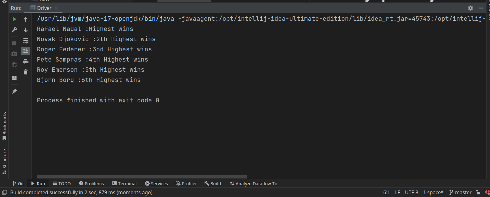

# Priority ques in java practical example
In this exercise, you are provided a list of Tennis Players along with their number of Grand Slam wins of
all time;and you are required to use a PriorityQueue to list them from highest to lowest wins along with
classifying them according to their wins.
 

You can find the  link to the question [here](src/Raw/Priority_Queue_lab.pdf)
 
The sample output is as below
 

